# Battery ERP Database Design

## Overview
This PostgreSQL design supports the following modules:
- Products
- Inventory
- Categories
- Brands
- Customers
- Users
- Roles
- Permissions
- Orders
- OrderItems
- Vendors
- Purchases
- PurchaseItems
- ServiceBookings
- Services
- Technicians
- Vehicles
- Payments
- Notifications
- WarrantyRecords
- AnalyticsSnapshots

All tables use UUID primary keys, include `createdAt`, `updatedAt`, and support soft deletion with `deletedAt`.

## ER Diagram

```mermaid
erDiagram
    BRAND ||--o{ PRODUCT : owns
    CATEGORY ||--o{ PRODUCT : organizes
    VENDOR ||--o{ PRODUCT : supplies
    PRODUCT ||--|| INVENTORY : stock
    CATEGORY ||--o{ CATEGORY : parent
    CUSTOMER ||--o{ ORDER : places
    USER ||--o{ ORDER : manages
    ORDER ||--o{ ORDERITEM : contains
    PRODUCT ||--o{ ORDERITEM : includes
    VENDOR ||--o{ PURCHASE : receives
    USER ||--o{ PURCHASE : creates
    PURCHASE ||--o{ PURCHASEITEM : contains
    PRODUCT ||--o{ PURCHASEITEM : includes
    SERVICE ||--o{ SERVICEBOOKING : schedules
    TECHNICIAN ||--o{ SERVICEBOOKING : executes
    CUSTOMER ||--o{ SERVICEBOOKING : requests
    VEHICLE ||--o{ SERVICEBOOKING : uses
    ORDER ||--o{ PAYMENT : pays
    PURCHASE ||--o{ PAYMENT : pays
    SERVICEBOOKING ||--o{ PAYMENT : pays
    USER ||--o{ NOTIFICATION : receives
    CUSTOMER ||--o{ NOTIFICATION : receives
    ORDER ||--o{ NOTIFICATION : tracks
    SERVICEBOOKING ||--o{ NOTIFICATION : tracks
    CUSTOMER ||--o{ WARRANTYRECORD : owns
    PRODUCT ||--o{ WARRANTYRECORD : covers
    PURCHASE ||--o{ WARRANTYRECORD : documents
    SERVICEBOOKING ||--o{ WARRANTYRECORD : supports
    ROLE ||--o{ USERROLE : assigns
    USER ||--o{ USERROLE : has
    ROLE ||--o{ ROLEPERMISSION : grants
    PERMISSION ||--o{ ROLEPERMISSION : owns
```

## Relationship Summary

### Products, Inventory, Categories, Brands, Vendors
- `Product` belongs to optional `Brand`, `Category`, and `Vendor`.
- `Inventory` has a one-to-one required relationship with `Product`.
- `Category` supports self-referencing parent/child categories.
- `Brand` and `Vendor` each own many `Product` records.

### Customers, Users, Roles, Permissions
- `Customer` and `User` are separate actor tables.
- `Role` and `Permission` are linked through `RolePermission` as a many-to-many join.
- `UserRole` connects `User` to `Role` via many-to-many with soft delete support.

### Authentication Tokens
- `RefreshToken` stores long-lived refresh tokens and validates refresh workflows.
- `PasswordResetToken` stores one-time reset secrets for forgot/reset password flows.
- Tokens are linked to `User` and support expiry, revocation, and soft deletion.

### Orders and Purchases
- `Order` belongs to a `Customer` and optionally a `User` sales rep.
- `OrderItem` line items reference `Order` and `Product`.
- `Purchase` belongs to a `Vendor` and optionally a `User` buyer.
- `PurchaseItem` line items reference `Purchase` and `Product`.

### Services and Bookings
- `ServiceBooking` ties `Service`, optional `Technician`, required `Customer`, and optional `Vehicle`.
- `Service` is a catalog of offered service types.
- `Technician` provides service execution details.
- `Vehicle` is owned by a `Customer` and can be used for service bookings.

### Payments
- `Payment` is polymorphic to support `Order`, `Purchase`, or `ServiceBooking`.
- Each payment record stores method, status, amount, and transaction metadata.

### Notifications
- `Notification` can target a `User`, `Customer`, `Order`, or `ServiceBooking`.
- It tracks delivery status with `isRead` and `readAt`.

### Warranty Records
- `WarrantyRecord` links a `Customer` to a `Product` and optionally to `Purchase` or `ServiceBooking`.
- This supports warranty claims and lifecycle tracking.

### Analytics Snapshots
- `AnalyticsSnapshot` stores time series or periodic metrics with JSON dimensions.
- Useful for dashboard, KPI, and reporting snapshots.

## Notes
- Soft delete behavior is implemented by `deletedAt` timestamps.
- All indexes are tuned for foreign-key lookups and common query filters.
- `uuid_generate_v4()` is used for UUID primary keys; the migration enables `uuid-ossp`.
